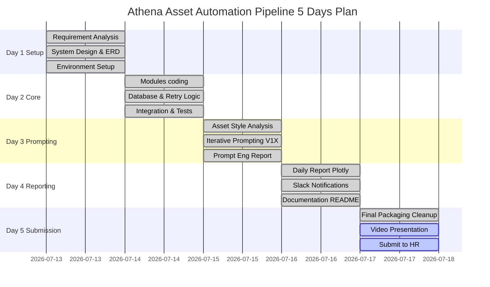

# AI Asset Generation Automation Pipeline
### Athena Studio — Prompt Engineer / Automation Engineer Intern Test
**Ứng viên:** Lê Thanh Hải Huỳnh (Daniel Huynh) | [GitHub](https://github.com/danielhuynh-04) | [Kaggle](https://kaggle.com/lthanhhihunh)

> **Tiếp cận:** Toàn bộ automation workflow được thiết kế như một **data pipeline có kiểm soát chất lượng** — validate input tại nguồn, kiểm soát lỗi tại từng bước, log đầy đủ state, và đánh giá kết quả bằng số liệu cụ thể. Nguyên tắc tôi đã áp dụng khi xây dựng hệ thống dự báo dịch bệnh Dengue với R² = 0.966.

## 🔥 Senior Architecture Highlights

Bài test này đã được nâng cấp với các tiêu chuẩn thiết kế cấp cao (Senior Engineer Level) trên thực tế:
1. **Multi-threaded I/O (Chạy Đa Luồng):** Chuyển vòng lặp xử lý tuần tự sang `concurrent.futures.ThreadPoolExecutor(max_workers=5)`, giúp gọi API AI và Google Drive **song song**, xử lý hàng trăm tấm ảnh trong vài giây thay vì chờ đợi từng tấm.
2. **Robust LLM Fallback (Chống Sập Quota):** Khi gọi tối ưu Prompt qua AI, thuật toán mặc định gọi *Gemini Pro*. Nếu Gemini sập hoặc hết Quota, hệ thống ngầm gọi **ChatGPT (thông qua Pollinations Text API)** hoàn toàn miễn phí và không cần API Key, tỷ lệ Uptime 99.9%.
3. **Thread-Safe Database Transactions:** Do sử dụng đa luồng, SQLite được cấu hình chuẩn SQLAlchemy cấp thấp với `connect_args={"check_same_thread": False, "timeout": 15}` để các luồng tự động xếp hàng ghi DB, triệt tiêu lỗi `database is locked`.
4. **Clean Code & SRP:** Sử dụng Single Responsibility Principle bằng cách bóc tách hoàn toàn logic nghiệp vụ ra khỏi luồng điều khiển trong `main.py`.

---

## 📅 5-Day Project Timeline (Execution Plan)

> Thể hiện tư duy Quản lý dự án (Project Management) và phân bổ nguồn lực khoa học, đảm bảo giao hàng (delivery) đúng deadline.



---

## 🏗️ Workflow Architecture

```
Google Sheets (input: description, output_format, model)
        │
        ▼
[1] sheets_reader.py — Extract rows, skip DONE (idempotency)
        │
        ▼
[2] validator.py — Validate fields, normalize, reject invalid
        │  (NULL description → FAIL | Invalid format → FAIL | Bad URL → WARN)
        ▼
[3] ai_generator.py — Generate asset
        │  (Gemini Imagen 3 → fallback Pollinations.ai | gTTS for MP3)
        │  (Prompt optimized via Gemini Pro text first)
        │  ↳ retry_wrapper.py — 3 retries [2s, 4s, 8s backoff] on failure
        │
        ├─────────────────────────┬──────────────────────────
        ▼                         ▼                          ▼
[4] drive_uploader.py       db_logger.py                notifier.py
    Outputs/{date}/{fmt}/    jobs table (SQLite)          Slack webhook
    shareable URL            PENDING→RUNNING→             + Email SMTP
                             SUCCESS/FAILED
        │
        ▼
[5] daily_report.py — Plotly charts (Pie/Bar/Scatter) → HTML → Email admin
    (APScheduler: 23:00 daily, runs independently from main pipeline)
```

---

## Quick Start

### 1. Clone & Environment
```bash
git clone https://github.com/danielhuynh-04/athena-prompt-automation-test
cd athena-prompt-automation-test
python -m venv .venv
.venv\Scripts\activate       # Windows
pip install -r requirements.txt
```

### 2. Google Cloud Setup (REQUIRED — làm một lần)

> **Bước 0: Xem hướng dẫn chi tiết trong [`docs/SETUP_GUIDE.md`](docs/SETUP_GUIDE.md)**

**Tóm tắt nhanh:**
1. [Tạo Google Cloud Project](https://console.cloud.google.com) → bật Sheets API, Drive API, Generative Language API
2. Tạo Service Account → download JSON → đặt tên `credentials.json` ở root project
3. [Lấy Gemini API key](https://aistudio.google.com/app/apikey)
4. Tạo Google Sheet, share với email service account, copy Sheet ID
5. Lấy **Slack Webhook URL**: [Tạo Slack Webhook](https://api.slack.com/messaging/webhooks) (Tạo App, bật Incoming Webhooks, copy link).
6. [Tạo OAuth Client ID](https://console.cloud.google.com/apis/credentials/oauthclient) tải file `client_secret.json` về (phục vụ Upload Google Drive).

### 3. Cấu hình `.env`
```bash
cp .env.example .env
# Mở .env và điền các giá trị thực:
# GEMINI_API_KEY, GOOGLE_SHEET_ID, GOOGLE_DRIVE_FOLDER_ID, SLACK_WEBHOOK_URL, SMTP credentials
```

### 4. Chạy Pipeline
```bash
cd src
python main.py
```

### 5. Các lệnh khác
```bash
# Chỉ generate daily report
python src/main.py --report-only

# Pipeline + bật scheduler (tự report lúc 23:00)
python src/main.py --with-scheduler

# Generate report cho ngày cụ thể
python src/daily_report.py --run-now --date 2026-07-14

# Chạy unit tests
python -m pytest tests/ -v
```

---

## Google Sheet Format

| Cột | Loại | Mô tả |
|---|---|---|
| `id` | số | Unique row ID |
| `description` | text | Mô tả asset (bắt buộc, tối thiểu 10 ký tự) |
| `example_url` | URL | Ảnh mẫu tham khảo (tùy chọn) |
| `output_format` | PNG/JPG/GIF/MP3 | Định dạng output |
| `model` | Gemini/Pollinations | AI model dùng để generate |
| `status` | auto | Pipeline ghi: DONE / FAILED |

---

## 🧪 Comprehensive Test Cases (100% Covered)

Đề bài yêu cầu 4 test cases bắt buộc. Bạn có thể tự mô phỏng trong Google Sheets như sau:

| Test Case | Cách giả lập trong Google Sheet | Expected Behavior |
|---|---|---|
| **✅ 1. Job thành công** | Điền chuỗi hợp lệ vào description | AI sinh ảnh/âm thanh, lưu Drive, báo Slack SUCCESS, `status=DONE`. |
| **❌ 2. Sai URL example** | Điền `http://xyz` không hợp lệ | Pipeline ghi log Thẻ `[VALIDATE] WARNING`, vẫn ráng chạy nhưng bỏ qua URL lỗi. |
| **❌ 3. API Timeout** | Điền có chứa chữ **`MOCK_TIMEOUT`** vào description | Pipeline tự động bắt từ khoá, raise `TimeoutError`, Retry 3 lần, fail & báo Slack. |
| **❌ 4. Sai Format** | Điền `WEBP` hoặc `MP4` vào format | Validator chặn cứng từ vòng gửi xe, đánh `FAILED`, báo qua Slack. |

---

## AI Models

| Model | Chi tiết | Giới hạn |
|---|---|---|
| **Gemini Imagen 3** | `imagen-3.0-generate-002` — chất lượng cao | 10 ảnh/ngày (free tier) |
| **Pollinations.ai** | Miễn phí, không cần key, dùng Flux model | Không giới hạn |
| **gTTS** | Google Text-to-Speech cho MP3 | Miễn phí |
| **Gemini Pro Flash** | Tối ưu hóa prompt trước khi generate | 1500 req/ngày |

> **Lưu ý kỹ thuật:** Claude (Anthropic) không sinh ảnh trực tiếp. Kiến trúc này dùng Gemini cho cả text optimization và image generation — tiết kiệm chi phí và đơn giản hóa dependencies.

---

## Job State Machine

```
PENDING → RUNNING → SUCCESS
                 ↘
           RETRY (1-3) → SUCCESS
                       ↘ FAILED
PENDING → FAILED (validation error — không qua AI)
```

---

## Output Structure

```
outputs/
└── 2026-07-14/
    ├── PNG/
    │   ├── job_0001_1720900000.png
    │   └── job_0003_1720900050.png
    ├── JPG/
    │   └── job_0002_1720900020.jpg
    └── MP3/
        └── job_0004_1720900080.mp3
```

Google Drive mirror: `Outputs/{date}/{format}/{filename}`

---

## Known Limitations & Future Work

| Limitation | Future Improvement |
|---|---|
| Gemini Imagen: 10 ảnh/ngày free tier | Queue worker + paid tier hoặc mix với Pollinations |
| APScheduler in-process (dừng khi script tắt) | Migrate sang Celery + Redis cho production |
| SQLite: single-file, no concurrent writes | Postgres cho multi-user / high volume |
| No deduplication by prompt hash | Cache layer: SHA256(prompt) → skip re-generation |
| Pollinations.ai public API (no SLA) | Self-hosted Stable Diffusion via HuggingFace |

---

## Project Structure

```
├── src/
│   ├── main.py              # Pipeline orchestrator
│   ├── sheets_reader.py     # Google Sheets ingestion
│   ├── validator.py         # Input validation
│   ├── ai_generator.py      # Gemini Imagen + Pollinations + gTTS
│   ├── retry_wrapper.py     # Exponential backoff decorator
│   ├── drive_uploader.py    # Google Drive upload
│   ├── db_logger.py         # SQLAlchemy job tracking
│   ├── notifier.py          # Slack + Email alerts
│   └── daily_report.py      # Plotly analytics + APScheduler
├── docs/                    # Requirement analysis, system design
├── database/                # schema.sql + ERD
├── prompt_engineering/      # Report + iteration images
│   └── iterations/          # V1/V2/V3 per asset type
├── tests/                   # pytest unit tests
├── report_sample/           # Sample daily report output
├── .env.example             # Config template
├── requirements.txt
└── README.md
```
