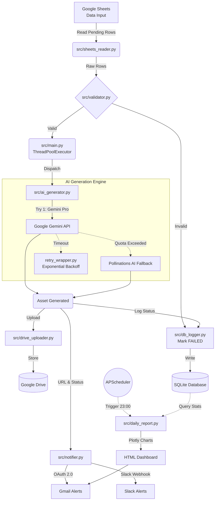
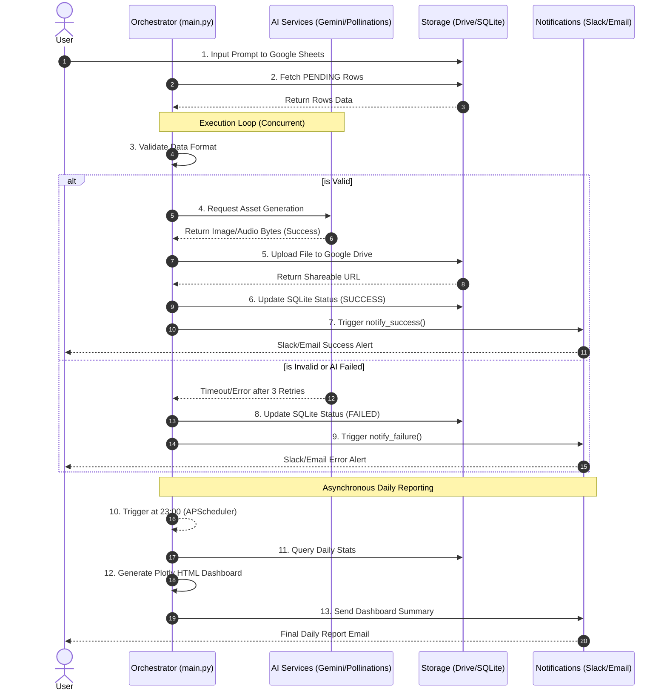

# 🏛️ System Design & Architecture
*Athena Studio - AI Asset Generation Automation Pipeline*

## 1. High-Level Architecture Diagram
Đây là kiến trúc luồng dữ liệu chính của AI Asset Pipeline. Hệ thống được thiết kế với tư duy Module hóa cao (Decoupled architecture) và có khả năng phục hồi lỗi (Fault-tolerant).

## 2. BPMN Workflow (Swimlane Diagram)
Quy trình nghiệp vụ chi tiết được mô phỏng dưới dạng Swimlanes để thể hiện rõ trách nhiệm của từng phân hệ (Separation of Concerns).

## 3. Core Design Principles Applied
1. **Idempotency (Tính luỹ đẳng):** Khả năng chạy lại pipeline nhiều lần mà không tạo ra side-effect (bot chỉ đọc và xử lý những dòng chưa có trạng thái `DONE` hoặc `FAILED`).
2. **Graceful Degradation:** Hệ thống tự động hạ cấp xuống dịch vụ miễn phí (Pollinations AI/ChatGPT) để duy trì luồng công việc thay vì Crash khi dịch vụ trả phí gặp vấn đề.
3. **Concurrency without Deadlocks:** Ứng dụng ThreadPool để xử lý I/O Bound song song, nhưng vẫn đảm bảo tính kiên định của Database bằng cấu hình SQLAlchemy phù hợp.
4. **Decoupling Validation from Execution:** Validator kiểm soát độc lập 100% rác dữ liệu trước khi tốn tiền gọi API.
